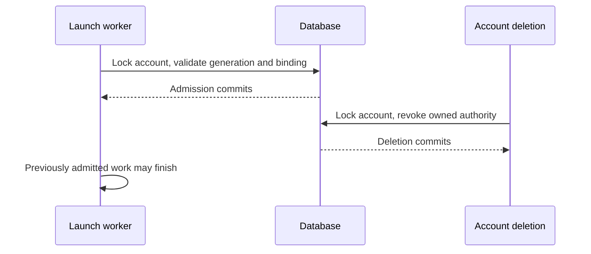

# Account deletion and authority revocation

After deletion succeeds, no new authentication, credentials, ownership, or
launch authorization can be granted to that account identity. Work admitted
before revocation may finish. Deletion is a database commit boundary; it does
not promise to kill an already running process or undo an external operation.

## Identity and saved authority

The username is a reusable display/login name. A random account generation
identifies one registration. Deletion retains a users-table tombstone, clears
its password and admin flag, and hides it from account/permission lookups.
Re-registration assigns a fresh generation.

Sharing can create a passwordless user before that person has an account.
The first admin password reset assigns a generation and password atomically,
preserving the shared permissions. Later password changes retain the generation.

Accounts JWTs carry that generation. Every authentication reads the account's
current generation and deletion status, including on other replicas; accounts
identity caching cannot extend access. Device and refresh grants, magic links,
scheduled tasks, and hosts retain their owner's generation. An explicitly saved
null generation means an external identity; it cannot acquire a subsequently
registered account's authority.

Session-permission cache keys include the authenticated generation. A new
registration cannot reuse another replica's old member or administrator cache
entry. Task listing, individual task access, and run-history access also check
the saved generation before returning private data.

Account authority travels with requests and work:

- Each accounts HTTP request or WebSocket handshake validates credentials in a
  worker. Logging and route helpers reuse that connection's immutable result,
  avoiding duplicate database checks and blocking I/O on the event loop.
- The result is scoped to the provider and workspace. Route helpers restore
  its captured authority in their own `ContextVar`; a new request validates
  against the database again.
- Async tasks and `asyncio.to_thread` inherit it.
- Durable scheduled work restores its saved generation.
- Context changes made inside a worker do not flow back to its caller.

Runner token issuance therefore resolves ownership, validates authority, and
mints the token within the same scoped worker and transaction:

1. Read the persisted host and session ownership. These owners may differ after
   an authorized admin launch.
2. Lock both accounts in username order and verify their captured generations.
3. Recheck the host/session/runner/owner binding under those locks.
4. Mint the token for the session owner.

Deletion of either owner prevents fresh issuance.

Operations on another user capture that target's generation before reading its
permissions or changing its password. A separate target scope carries the
snapshot through worker calls without replacing the acting identity. Writers
validate both under the ordered account locks; a target that was absent also
cannot silently become a new accounts registration between lookup and write.
A deleted/replaced target returns a conflict (409); an invalid actor still
returns unauthorized (401), including when both registrations have changed.

OIDC/header identities and scoped machine-principal tokens retain their own
lifecycle. The single-user local identity continues to work without an accounts
registration.

## Transaction ordering

Authority writes follow this order within one transaction:

1. Lock account rows in username order, including the actor, targets, and any
   related resource owners. Account deletion locks the full
   administrator/actor/target set.
2. Validate captured generations under those locks. Account deletion also
   enforces the last-admin invariant before changing resources.
3. Lock and update grants, hosts, or other resources while retaining the account
   locks.

Checking generations under the locks prevents a request authenticated earlier
from writing authority into a replacement account.

Database handling differs:

- **PostgreSQL:** use locking reads.
- **SQLite:** use immediate write transactions.
- **MySQL:** use locking reads and retry deadlock victims by replaying the entire
  rolled-back transaction with bounded backoff. This includes concurrent first
  writes that contend on missing rows.
- **CockroachDB:** use locking reads and retry serialization failures by
  replaying the entire rolled-back transaction.

Deletion removes session permissions, saved provider connections, projects,
project ordering, daily spending/approved budget checkpoints, and outstanding
invitations/magic links created for or by the user. It disables scheduled tasks
and revokes device/refresh grants. Session history remains, with project/host
bindings detached where required. A reused username does not inherit those
permissions, credentials, or projects.

Daily spending and budget approvals follow the same ordering:

1. Read the session owner's username and generation together. Sub-agent cost
   reporting falls back to the root session's owner when the child has no grant.
2. Carry that snapshot in a target scope, preserving any authenticated actor.
   An administrator and the session owner can be different accounts; background
   reporting can have no request actor at all.
3. Lock and validate those accounts inside the daily-record write transaction,
   before the UPSERT. A saved null generation cannot acquire a later account.
4. Commit the daily write, or reject it if deletion/re-registration won the race.

If the daily write commits first, deletion removes it. If deletion commits
first, the delayed write cannot recreate it. Budget approval updates the policy
engine's in-memory checkpoint only after the guarded write succeeds. Retained
session usage can still describe completed work; it does not become the new
registration's daily budget state.

Scheduled-task timers follow the persisted task state:

- Deletion removes the timers already known to the handling server.
- A late registration or another replica's timer unregisters when its next fire
  observes a missing, paused, or deleted task.
- Skipping an overlapping fire keeps the next occurrence armed. A stale callback
  cannot remove a replacement timer registered while it was running.
- Manual "Run now" permits paused tasks but rejects deleted tasks, including
  deletion between the request's first read and background execution.

Scheduled work checks registration identity before contacting a host:

1. Compare the saved task generation with the live owner's generation before
   resolving a host.
2. Select or authorize only a host with the same saved generation.
3. Keep the task's expected host owner in a separate scope through every host
   RPC. Before queuing a frame, compare the connection's workspace, username,
   and generation with that snapshot. Reusing a host ID cannot redirect the
   task to a different user or registration.
4. Reject a replaced connection object. Outside scheduled work, a connection
   owned by the caller must also match the caller's captured generation;
   authorized operations with different host and session owners remain valid.

These checks precede workspace RPCs and session creation. Final authority-write
and launch-admission checks still order those operations against deletion.

Account deletion and ordinary host deletion share one host-cleanup operation.
Host rows are locked before cleanup, preventing a concurrent dormant-sandbox
replacement from escaping between bulk statements. Launch credentials are
cleared. Managed-host tombstones preserve pending sandbox IDs until the existing
provider cleanup worker confirms termination. Provider destruction happens
outside the account transaction; failures leave cleanup retriable.
Registration failures after provisioning also attempt to terminate the new
sandbox. An ID already retained for active work or pending cleanup remains under
the existing host lifecycle.

## Launch admission

All host launches pass a final database admission check immediately before
runner binding and launch-frame dispatch. In accounts mode, admission uses the
same live session-owner query as runner token issuance:

1. Capture the session owner's registration from its owner permission grant.
2. Lock the actor, host owner, and session owner in username order, then check
   their captured generations.
3. Recheck the session owner grant under those locks.
4. Validate the live host and session-host binding.

A retained session without a live owner is rejected before runner binding or
dispatch. OIDC/header and unauthenticated deployments retain their existing
owner lifecycle. A scheduled task's earlier host resolution is not admission.

An explicit host transfer first authorizes the caller against the destination
host and the session. Final admission also accepts the source host binding
captured by that resolution: Switch Host and CLI resume clear the runner while
retaining that binding. A move to an unrelated host in the meantime invalidates
the snapshot. Initial launches may admit an unbound session; automatic restarts
still require the destination binding. The conditional runner write prevents
overwriting a runner claimed by another launch.



If deletion commits first, admission fails and no launch frame is queued. If
admission commits first, dispatch may complete afterward. This makes the race
well-defined without holding a database transaction across a network operation.
A running runner must still obtain fresh authority for new owner credentials;
its binding token cannot mint for a deleted or re-registered identity.

## Migration and deployment

The migration assigns generations to existing password-bearing users and
backfills their saved authority. Existing credentials behave as follows:

- **Valid refresh grants:** retain their secrets and can renew into
  generation-bearing JWTs.
- **Ordinary cookies/JWTs:** lack the generation claim and require login again.
- **OAuth connection handshakes:** should be restarted after upgrade.

Schema changes handle database differences:

- **All databases:** check for existing columns before adding them.
- **CockroachDB:** commit new columns before reading them for backfill. The
  upgrade can resume after an interruption between schema commit and backfill.
- **MySQL:** individual `ALTER TABLE` statements commit even if the upgrade
  later fails. Checking for existing columns allows the upgrade to resume.

Accounts-mode deployments require a coordinated stop/upgrade/start of every
server and scheduler sharing the database. Mixed old/new versions are unsafe:
old code ignores tombstones and generations.

1. Back up the database.
2. Stop all writers, including every server and scheduler sharing the database.
3. Upgrade the application and run the migration.
4. Restart only the new version.
5. Log in again with ordinary browser sessions and restart any OAuth connection
   handshakes that began before the upgrade.

Do not roll back to old code against the new schema. Downgrade removes account
tombstones so old code cannot interpret them as active passwordless users; it
does not undo external cleanup or restore removed authority.

## Verification

### Review and regression inventory

Review the writers of every row deletion removes or disables. Authentication
checks alone do not cover runtime cost reporting, delayed callbacks, or work
performed on somebody else's resources.

| Authority or state | Production boundary to exercise | Regression coverage |
| --- | --- | --- |
| Cookies, refresh grants, and magic links | Login/redemption, credential minting, subsequent request on another replica | Accounts/device HTTP tests; two CLI servers sharing a database |
| Permissions and password reset | Actor and target lookup, passwordless sharing, locked grant/reset, login with resulting credentials | `test_target_write_cannot_cross_registration`, `test_reset_provisions_shared_user_credentials` |
| Provider connections and projects | OAuth state restoration, credential/project/order writes, username reuse | `test_oauth_connection_state_cannot_cross_username_reuse`, store cleanup and stale-writer checks |
| Scheduled work | Timer registration, saved owner lookup, host selection, workspace RPC, final admission | `test_late_schedule_registration_stops_after_account_deletion`, `test_stale_schedule_cannot_contact_replacement_host`, `test_scheduled_dispatch_obeys_revocation_boundary` |
| Host and runner credentials | HTTP launch, host WebSocket, owner snapshot, binding, token issuance | Launch/transfer HTTP tests and store races for both owners and every binding field |
| Daily spending and approvals | HTTP usage report or approval, owner lookup, worker handoff, locked UPSERT, replacement's next budget evaluation | `test_daily_budget_write_obeys_account_lifecycle`; background/root-owner and two-ordering database tests |
| Whole deletion | A later cleanup statement fails after earlier statements have executed | `test_cleanup_failure_rolls_back_revocation`, including daily spending and approvals |

For changes to an authority path:

1. Identify every writer and consumer, including background workers and other
   authentication modes. Record whose registration authorizes the operation and
   whose registration owns its result; these may differ.
2. Trace where each identity is captured and how it crosses tasks, worker
   threads, persisted jobs, and processes. Use the saved generation through the
   final write or admission check.
3. Force both orderings with explicit barriers: work commits before deletion,
   and deletion commits before work. Also replace the username after its old
   ownership was read. Check both the response and the persisted/external effect.
4. Exercise ordinary successful use, a different administrator actor, work with
   no request actor, and external identities where those callers exist. Include
   a replacement account's first real operation so inherited state is observable.
5. Reproduce each suspected regression before fixing it, then retain the test.
   Track static review claims separately from reproduced failures.
6. Run the affected database lanes and production startup checks at the final
   revision. Report which clocks, host responses, and provider operations were
   simulated, and which paths were not run.

The HTTP/store regressions run in the regular server/store CI suites. Vendor
database lanes exercise the same store tests. The matrix is a review inventory,
not a claim that every possible interleaving or live provider has been tested.

Run the revocation HTTP/store/migration tests and the real two-server startup
check from the candidate checkout:

```sh
uv run --no-sync pytest tests/server/test_account_revocation.py tests/stores/test_account_revocation.py tests/server/scheduled tests/db/test_migration_account_revocation.py tests/server/integration/test_account_revocation_processes.py -q
```

Run the store suite against isolated PostgreSQL, MySQL, and CockroachDB instances
using `OMNIGENT_TEST_DB_URI` as well. SQLite skips snapshot-before-lock races
because its immediate transaction already holds the database-wide writer lock.
The launch tests use real orchestration, stores, and outbound frames with a
simulated host response. They do not start a runner process or an external
sandbox. The two-server test launches actual CLI subprocesses and sends HTTP
requests against shared SQLite. Neither test calls an LLM/provider or establishes
production rollout readiness.

The timer registration/deletion regression uses the real HTTP routes, stores,
scheduler, and fire callback with a simulated clock and timer. It verifies
unregistration at the next occurrence, without waiting for wall-clock time.

For a human check on an isolated accounts deployment:

1. Log in as a non-admin in one browser profile and as admin in another.
2. Delete the non-admin account.
3. Verify that the first profile's next protected request requires login.
4. Register that username again.
5. Verify that the original cookie still fails and the replacement account can
   log in with no saved connections, projects, or session ownership.

To verify first-time password provisioning:

1. Share a session with a username that has never registered.
2. As admin, reset that user's password.
3. Log in with the returned password and confirm the shared session is visible.
