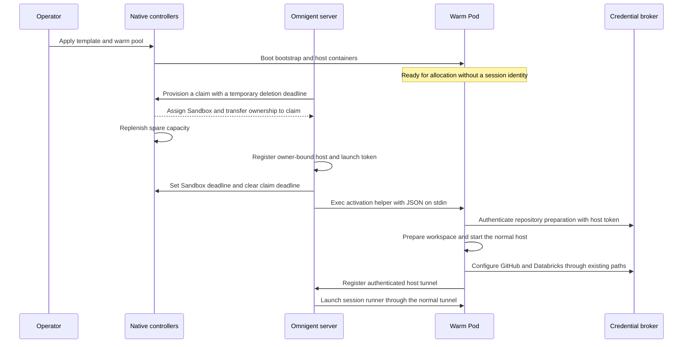

# Agent-sandbox warm pools

Omnigent supports native agent-sandbox warm allocation as an opt-in path of the
`agent_sandbox` provider. A spare Pod boots before a session exists, then receives
its managed-host identity and prepares the session's workspace after allocation.
The credential store, GitHub/Databricks brokers, host tunnel, and runner launch
remain the existing implementations.

Implementation baseline: `main` at `04c6c171c`. The upstream API contract targets
agent-sandbox **v1.0.0**, with `extensions.agents.x-k8s.io/v1beta1` templates,
pools, and claims. This document describes the implementation; deployment and
verification commands are in the
[warm-pool runbook](../deploy/kubernetes/overlays/sandbox-runners/warm-pool/README.md).

## Resources and ownership

| Resource | Owner and purpose |
| --- | --- |
| `SandboxTemplate` | Operator-owned static Pod profile, including image, mounts, resources, scheduling, security, and optional HOME claim template. |
| `SandboxWarmPool` | Operator-owned inventory of unallocated Sandboxes created from that template. |
| `SandboxClaim` | Omnigent-owned request for one Sandbox from a named pool. |
| `Sandbox` | Native controller-managed workload; after allocation its controlling owner reference points to the claim. |
| Managed host | Omnigent's owner-bound identity and launch-token record, created after allocation and before activation. |

Allocated Sandboxes leave the spare inventory. The native controller replenishes
the pool with fresh Sandboxes; Omnigent never returns a used workspace to the
pool. An empty pool may use upstream cold creation from the same template, so
successful claim assignment alone does not demonstrate a warm hit.

The server selects a pool with:

```yaml
sandbox:
  provider: agent_sandbox
  agent_sandbox:
    warm_pool: omnigent-default-v1
  kubernetes:
    image: your-registry/omnigent-host:your-version
```

All existing `sandbox.kubernetes` settings remain in their current location.
The manifest generator renders the template from this same configuration. The
pool is static infrastructure: the application reads it, but does not create,
resize, or update it.

For deployments using the owner-bound GitHub and Databricks brokers, generate
the pool with `--shared`. This explicitly permits different built-in agents,
uploaded agents, and session harnesses to share spare inventory when their
infrastructure settings match. The host image must support the requested
harness. A shared template omits the `omnigent.ai/agent` label and carries the
annotation `omnigent.ai/warm-pool-shared: "true"` in its Pod template. The marker
is included in the profile fingerprint; a missing agent label by itself does
not grant shared behavior to an existing pool.

## Allocation precedes host registration

`prepare_for_launch()` receives the server-resolved agent classifier before
provisioning. `provision()` reads the selected pool and template, validates the
profile, creates a claim, and waits for assignment. It returns an opaque
`wp1:` handle containing namespace, claim name/UID, and Sandbox name/UID.

The managed-host layer then registers the host and launch-token digest against
that handle. Only after registration succeeds does `start_host()` deliver the
token to the Pod. This ordering preserves the existing broker contract: a host
identity is resolvable before any repository or provider setup uses it.



Before a host row exists, cleanup cannot rely on that row. A new claim therefore
has a temporary `lifecycle.shutdownTime` with `shutdownPolicy: Delete`. It bounds
resource retention if the server disappears during allocation. Registration
failure also triggers best-effort termination of the newly allocated claim.

After registration, `start_host()` first arms the Sandbox's boot deadline with
`shutdownPolicy: Retain`, then clears the claim lifecycle deadline. Cleanup now
belongs to the managed host. Claim expiry is not used for normal inactivity:
upstream claim expiry deletes backing resources, while Sandbox expiry preserves
the durable workspace.

## Static Pod, session-specific activation

The generated template contains two **regular containers**, both started before
allocation:

| Container | Mount visibility | Responsibility |
| --- | --- | --- |
| `bootstrap` | HOME, writable activation volume, and the existing clone-time static credential lane | Wait for activation, run the existing repository/config preparation command, report its stage. |
| `host` | HOME, read-only activation volume, runtime PVC/Secret mounts, and configured runtime environment | Wait for successful preparation, then start the normal managed host. |

The preparation container is derived from the direct provider's init container,
but runs as an ordinary container so it can wait without blocking Pod startup.
Runtime mounts remain absent from repository preparation. Non-root execution,
security contexts, disabled ServiceAccount token automount, runtime class,
scheduling constraints, static Secret projection, and configured storage are
retained from the existing manifest builder.

**Both containers reserve the configured resources.** Kubernetes sums regular
container requests. For example, a `250m` CPU / `384Mi` memory configuration
reserves `500m` / `768Mi` for each pooled Pod, before any admission-added
containers. This differs from the direct init-container scheduling calculation
and must be included in pool capacity planning.

The image must include `omnigent.host.warm_bootstrap`. The initial activation
protocol is version 1 and includes the actual Pod UID, generation, host ID/name,
launch token, server URL, and server-rendered workspace preparation command.
Repository descriptors and host configuration are incorporated in that command
using the existing preparation renderer.

The selected harness resolves its model and provider when it launches. Host
startup still prepares gateway configuration for multiple supported harnesses
in the background; it does not run inference for each one. Static credentials
and owner-bound broker access remain scoped to the sandbox, not isolated by
harness. Shared pool matching does not change those existing semantics.

The provider invokes a fixed bundled helper through Kubernetes exec and sends
one newline-terminated JSON payload on stdin. It does not put the launch token
in the exec command, template, claim, label, annotation, or status output. The
exec client has its own Kubernetes API client because the Python streaming
transport changes that client's request implementation.

Activation is stored atomically in a private directory on a memory-backed
`emptyDir` outside persistent HOME. It is bound to the Pod UID and immutable
for that Pod lifetime. Identical delivery retries succeed; a different
assignment is rejected. The generation is derived from the launch token. If an
exec response is lost, the provider reads the nonsecret status and accepts an
observed matching generation instead of assigning another host.

Preparation advances through `bound`, `preparing`, and `prepared`, or `failed`.
Readiness means bootstrap can accept activation, not that the managed host is
online. `start_host()` waits for preparation; the existing server path separately
waits for the authenticated host and launches the runner.

Preparation stdout/stderr are suppressed because repository commands and
credential helpers can emit sensitive information. Failure reports identify
the stage without forwarding arbitrary command output. This reduces clone
diagnostic detail; normal host logs remain available after host startup.

## Profile and identity checks

The provider compares declared template fields with the expected static profile,
tolerating Kubernetes defaults and additive admission fields. It repeats
validation on the allocated Sandbox and actual Pod, including resolved HOME PVC
names. A profile annotation records the rendered profile digest. Templates must
not contain a managed-host identity or per-session launch token.

| Situation | Behavior |
| --- | --- |
| Pooling disabled | Existing direct Sandbox provisioning and lifecycle. |
| Explicitly shared template with compatible infrastructure | Pool allocation for any session harness or trusted agent classifier, including uploaded agents. |
| Dedicated or legacy unclassified template differs from the session's trusted classifier | Direct Sandbox fallback. Without `--shared`, an empty classifier still requires an exact match. |
| Selected shared or dedicated template/Sandbox/Pod has an incompatible infrastructure profile | Fail explicitly and ask the operator to generate a new versioned pool. |
| Claim, Sandbox, or Pod ownership/UID changes | Reject the replacement rather than silently accepting a different workspace. |
| Pod UID changes during activation | Fail the activation and let the session retry. |
| Pool has no ready spare | Native allocation can create a cold member; readiness and activation still apply. |

The claim handle pins both claim and Sandbox UIDs. Allocation checks require
the claim to still select that Sandbox, the Sandbox to have the claim as its
controller owner, and the Pod to have the Sandbox as its controller owner.
Legacy Pod-name annotations are respected. Cleanup uses UID preconditions, so
reusing a resource name cannot delete a later allocation accidentally.

The generator accepts mutually exclusive `--shared` and `--agent-name NAME`
options. The latter creates a pool dedicated to the exact built-in classifier
and retains its admission-time behavior. Omitting both options preserves legacy
unclassified matching; it does not enable shared allocation implicitly.

Per-agent admission-time credential injection does not apply to an unlabeled
shared pool. Operators that require it should use a dedicated `--agent-name`
pool. Omnigent does not relabel allocated Pods: changing a label after creation
cannot rerun admission and is not a way to change the allocation's identity.
Images, runtime classes, resources, mounts, scheduling, and security settings
still belong in every template and undergo the same infrastructure validation.
Use versioned template/pool names when changing modes or profiles. Generated
pools use the native `Recreate` update strategy for unused inventory.

### Initial-release constraint: no migration of allocated profiles

An allocated Sandbox retains its original static infrastructure profile.
Changing the server's image, mounts, resources, scheduling, or security settings
can block a later wake of that session. Shared allocations allow a different
agent classifier or harness on wake when the infrastructure profile still
matches; their template remains explicitly shared and has no per-agent label.

Dedicated and legacy unclassified allocations continue to require an exact
classifier match. Switching an agent can remove its original built-in
classification while the retained Sandbox still has that classifier. Validation
then fails and the Sandbox/PVC remain preserved. Shared mode does not weaken
ownership, Pod identity, infrastructure, or credential checks on activation.

Changing the global `warm_pool` setting only changes new allocation selection;
it does not migrate existing claims, profiles, or workspaces. `Recreate` likewise
affects only unused inventory. Use direct provisioning for new sessions that
need dynamic infrastructure profiles. For classifier changes alone, select an
explicitly shared pool for the initial allocation. Changing the configured pool
does not convert an existing dedicated allocation to shared mode, and disabling
pooling does not convert warm allocations into direct ones. This release does
not rebuild assigned Pod templates to accommodate those changes: the native
claim controller also reconciles their metadata from the referenced template.

## Credentials and durable lifecycle

The encrypted connection store and provider resolvers are unchanged. After
activation, the existing host-token-authenticated broker resolves the host's
owner and serves that owner's GitHub or Databricks credentials. Private cloning,
Git/gh configuration, Databricks configuration, and provider refresh use their
existing paths. Warm activation does not distribute provider refresh tokens or
copy another user's credentials into a spare Pod.

Shared mode changes which agent classifiers can consume the same infrastructure
profile. It does not broaden GitHub or Databricks credential access: the broker
still resolves credentials through the allocated host's owner. Host startup
continues to initialize its harness configurations through the existing host
path.

Operator-provided static harness Secrets remain supported when configured in the
template. Their `envFrom` values are captured when the Pod starts, so rotating
such a Secret requires replacing unused Pods before relying on the new value.
Broker-only verification avoids static credentials masking an integration error.

Durable HOME is created from the template's `volumeClaimTemplates`, using the
existing workspace-volume environment settings. Each member gets its own PVC.
Per-claim environment and PVC overrides are intentionally absent because
upstream bypasses warm reuse for those overrides.

Busy sessions extend the assigned Sandbox's deadline. Expiry removes its Pod
while retaining the Sandbox and PVC. Resume validates the stored allocation,
removes an old Pod if necessary, registers a fresh launch token, and activates
the replacement Pod against the same workspace. It does not consume another
pool member. Missing or replaced allocations surface as `SandboxGoneError` so
the server can use its existing fresh-generation recovery path.

Permanent termination deletes the claim with foreground propagation and a UID
precondition. Native ownership removes its Sandbox and owned workload/storage;
external operator-managed mounts retain their existing ownership. The existing
managed-host cleanup revokes the token and retries failed termination.

## Permissions and networking

Warm mode adds a separate namespaced Role/RoleBinding to the current sandbox
manager permissions:

- Claims: `create`, `get`, `patch`, `delete`.
- Templates and pools: `get` only.
- `pods/exec`: `get`, `create`.

Kubernetes RBAC cannot restrict exec to the activation helper command. This is
an explicit permission expansion in the runner namespace. Runner ServiceAccounts
remain unprivileged and do not receive these grants.

Generated templates set `networkPolicyManagement: Unmanaged` and
`dnsPolicy: ClusterFirst`, preserving the direct provider's networking model.
Operators own production network isolation, including DNS and egress to the
Omnigent callback and required Git/Databricks services. The template does not
silently apply upstream's default private-range egress restrictions.

## Validation and remaining measurements

The manifest generator has been exercised with the exact `python -m` command,
and its Template/Pool output validates against upstream v1.0.0 CRD schemas.
Automated coverage includes configuration, bootstrap state/identity behavior,
and provider lifecycle. An opt-in live E2E test exercises the complete
managed-session request path against a configured test deployment without
requiring inference.

The live check records Pod UIDs **before** requesting a session, verifies that
the claimed host uses one of them, waits for host/runner registration, writes
and reads a workspace marker, and waits for spare capacity to replenish. The
[runbook](../deploy/kubernetes/overlays/sandbox-runners/warm-pool/README.md)
also describes credential and durable-workspace checks. The allocation test
does not need connected-account credentials; broker and owner-isolation checks
require separately configured test accounts and user authentication.

A warm hit should move image
pulling, scheduling, container startup, and initial PVC provisioning before the
request. Repository preparation, broker setup, host registration, runner launch,
and model startup remain on the request path. Measure those separately before
choosing pool size or promising latency. Validate NetworkPolicy enforcement in
a test deployment with the intended production network controls enabled.

## Implementation map

- [Warm launcher and manifest generator](../omnigent/onboarding/sandboxes/agent_sandbox_warm_pool.py)
- [Bootstrap protocol and processes](../omnigent/host/warm_bootstrap.py)
- [Existing direct Sandbox lifecycle](../omnigent/onboarding/sandboxes/agent_sandbox.py)
- [Shared Pod and workspace preparation](../omnigent/onboarding/sandboxes/kubernetes.py)
- [Managed-host registration and recovery](../omnigent/server/managed_hosts.py)
- [Existing credential broker](../omnigent/server/routes/host_credentials.py)
- [Opt-in live E2E test](../tests/e2e/test_agent_sandbox_warm_pool.py)
