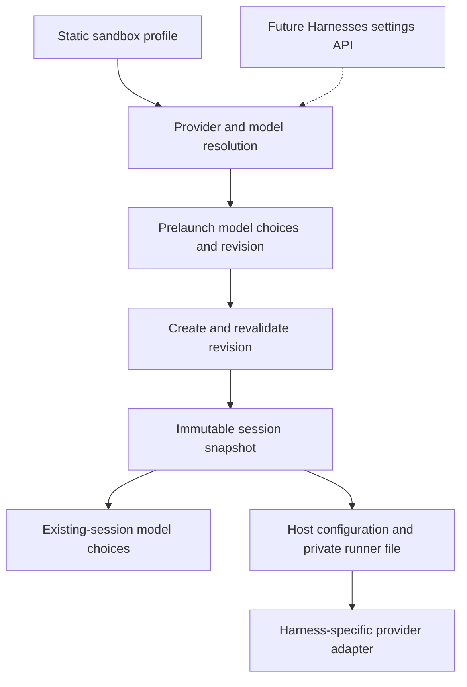

# Model and provider selection for managed sandboxes

Operators can bind each harness to a named provider and expose a short model
list in both session composers. For example, Claude Code can use Databricks
Unity Gateway while Codex and Pi continue using Bifrost. This configuration is
shared by the `kubernetes` and `agent_sandbox` providers.

Provider and model-policy edits apply to **new sessions**. Existing sessions
keep their accepted configuration across model changes, runner restarts,
sandbox wake/replacement, and server restarts. Credentials are refreshed through
saved references; tokens are never part of the snapshot.

This is opt-in per sandbox target: a nonempty
`sandbox.host_config.inference.harnesses` mapping enables it. Ordinary hosts and
sandbox targets without bindings retain their existing authentication, provider
defaults, and model selection. `/v1/info` advertises `inference_models` only for
configured targets; other targets do not request preview catalogs or wait on
discovery. The new credential-reference restrictions apply to saved inference
profiles and explicitly configured discovery credentials, not legacy host configs.

## Configuration

Add providers and harness bindings to the existing `sandbox.host_config`.
For gateways, `sandbox.model_discovery` is optional when each bound harness has
an explicit `model_allowlist`. This mode trusts the operator's list and needs no
server catalog key or inventory request. With discovery enabled, the catalog
credential must represent the same model entitlement as the Pod's inference
credential, and both the server and Pod must reach their respective URLs.

The model names below are placeholders for exact IDs returned by your gateway.
Use a sandbox image containing the same inference-profile support as the server.

```yaml
sandbox:
  provider: agent_sandbox # or kubernetes
  server_url: https://omnigent.example.com
  kubernetes:
    secret_name: harness-credentials

  # Optional with a curated allowlist; resolved only on the server.
  model_discovery:
    bifrost:
      base_url: https://bifrost.example.com/v1
      api_key_ref: env:BIFROST_CATALOG_KEY
      # auth_command is an alternative to api_key_ref.

  host_config:
    providers:
      bifrost:
        kind: gateway
        anthropic:
          base_url: https://bifrost.example.com/anthropic
          api_key_ref: env:BIFROST_INFERENCE_KEY
        openai:
          base_url: https://bifrost.example.com/v1
          api_key_ref: env:BIFROST_INFERENCE_KEY
          wire_api: responses
      unity:
        kind: databricks
        connection: databricks

    inference:
      harnesses:
        claude-native:
          provider: unity
          default_model: workspace-claude-primary
          model_allowlist: [workspace-claude-primary, workspace-claude-fast]
        claude-sdk:
          provider: bifrost
          default_model: claude-primary
          model_allowlist: [claude-primary, claude-fast]
        codex-native:
          provider: bifrost
          default_model: gpt-primary
          model_allowlist: [gpt-primary, gpt-fast]
        pi-native:
          provider: bifrost
          default_model: gpt-primary
          model_allowlist: [gpt-primary, gpt-fast, claude-primary]
```

`BIFROST_CATALOG_KEY` belongs in the server environment.
`BIFROST_INFERENCE_KEY` belongs in the Kubernetes Secret projected into the Pod.
Use `api_key_ref` (`env:VAR`, `$VAR`, `${VAR}`, or `keychain:name`) or an
`auth_command` that retrieves a credential; literal keys in `api_key` or
`api_key_ref` are rejected before snapshots are created. Endpoints must be
literal HTTP(S) URLs without embedded credentials, query strings, fragments, or
environment substitutions, so the accepted endpoint can be saved reliably.

`connection: databricks` uses the session owner's existing Databricks connection
and credential broker. It is mutually exclusive with the existing local
`profile:` selector. Connect the account before choosing its Unity harness.
The workspace identity is pinned: disconnecting or reconnecting to a different
workspace makes the old session unavailable until its original access is
restored. Other harnesses' Bifrost routes continue to work without a Databricks
connection.

With multiple sandbox providers, shared configuration and per-provider overrides
follow the existing `sandbox.providers` merge behavior. Each selected provider
has its own target identity and configuration revision.

## Model policy and transport

Gateway catalogs have three modes:

| Allowlist | Discovery | Composer choices |
| --- | --- | --- |
| Present | Absent | Operator's curated IDs, in order |
| Present | Present | Allowlist intersected with the compatible live catalog |
| Absent | Present | Full compatible live catalog |

Without discovery, Omnigent enforces the saved allowlist but cannot confirm
availability or model capabilities in advance; errors surface when the harness
uses the model. A gateway with neither setting is rejected. Connected Unity
always uses its owner's live catalog, independently of `model_discovery`.
With discovery, the visible catalog intersects gateway availability, supported
protocol/capabilities, and the allowlist when present.

- An omitted allowlist adds no restriction. An empty list permits no models.
  A singleton list stays restricted and visible as such.
- An explicit list preserves operator order. Its default must belong to the
  selected catalog. With discovery, an unavailable default blocks creation or switching
  instead of silently choosing a different model.
- Provider tier aliases resolve to exact IDs, with cycle detection. Literal
  slashes and dots in gateway IDs remain intact. Pi and ACP resolve aliases
  across both configured families; an alias pointing to different IDs is
  rejected as ambiguous. Use exact IDs to disambiguate.
- Discovery failure and a successful empty intersection have distinct error
  states. Neither falls back to public models or the server's ambient providers.
- An explicit binding is authoritative. Conflicting agent authentication or a
  legacy executor Databricks profile is rejected. Smart Routing cannot replace
  the bound provider.
- Unconfigured targets and harnesses retain existing behavior. These settings
  govern Omnigent model selection; they are not a network boundary for arbitrary
  code running in a sandbox.

| Harness | Gateway transport |
| --- | --- |
| Claude native / SDK | Anthropic Messages |
| Codex native / SDK | OpenAI Responses |
| Pi native / SDK | Configured Anthropic or OpenAI transport |
| OpenAI Agents SDK | Configured OpenAI transport |
| Qwen, OpenCode native, Jcode | OpenAI Chat Completions |
| `acp` or `acp:<slug>` | Catalog policy; the installed ACP CLI owns its authentication and transport |

Configure native and SDK harnesses separately. Exact `acp:<slug>` bindings take
precedence over an explicitly configured generic `acp` binding. The provider
binding does not configure authentication for arbitrary ACP programs; retain
the program's existing login/configuration. A namespace in a model ID does not
select another provider.

Connected Unity providers materialize Anthropic and Responses endpoints.
Qwen, OpenCode, and Jcode therefore need a separate named Chat-compatible gateway
entry rather than this connection shorthand. OpenCode and Jcode resolve their
auth commands on process launch; restart/resume obtains a fresh token. They do
not gain continuous credential refresh from this feature. Pi SDK uses one
credential across both families; configure both gateway endpoints to accept
that same credential. When both families are configured, Pi identifies Anthropic
models by `claude` in the model ID; opaque Anthropic IDs can be excluded even
when the gateway advertises their wire protocol.

## Configuration lifetime



`GET /v1/sandbox-providers/{provider}/harnesses/{harness}/model-options`
previews the catalog without provisioning a Pod. Optional `agent_id` supplies
agent context after access checks. The response includes model rows, provider
label, default, status, and a configuration revision; it includes no credential
values or authentication commands.

The new-session composer submits `inference_configuration_revision` with the
chosen model. A changed revision returns HTTP 409 before session rows or bundle
artifacts are created. The composer refreshes choices and retains the draft;
it requires the user to submit again.

Creation saves the actual harness identity, target/revision, provider settings,
model policy, credential references, and workspace identity as compressed JSON in
Omnigent's conversation metadata. Server-only discovery settings are also saved
there. The nullable `inference_snapshot` column uses `BLOB` on MySQL, with a
65,535-byte limit including compression framing. Reads accept legacy uncompressed
JSON. New snapshots exceeding the compressed limit are rejected before session
rows are created; reduce the configured model catalog or allowlist to fit.
The compact AP-owned session-overrides field is unchanged. Children inherit the full configuration and
resolve their own harness binding; forks retain it even when resetting model
settings. Configured sessions cannot switch agents or fork into another harness
or another owner's credential scope; create a new session for those changes.
Same-harness forks validate their model against the saved policy before writes.
Sessions with saved sandbox profiles can launch only on server-managed sandbox
hosts, including when forked or restarted. Ordinary hosts keep their own provider
configuration; start a new session to use one. Admission checks the actual
destination host, so a fork can still reuse its original managed sandbox.

The compression migration runs online with database readers and writers stopped.
It commits the backfill in batches of at most 100 metadata rows. Interrupted copies
restart from the original column; completed column swaps are detected on retry.
Run it through the normal migration runner without an enclosing transaction.
It clears only snapshots that still exceed the limit. A cleared snapshot loses its
saved provider bindings, model policy, and catalog; the session retains its other
metadata and follows the legacy behavior for sessions without snapshots. Deploy
the updated code before resuming
traffic. Downgrade decompresses retained snapshots back to text and cannot recover
cleared snapshots. The 65,535-byte cap, irreversible clearing of oversized values,
and coordinated schema/application cutover are deliberate requirements of this
existing-column conversion, matching the preferences conversion. They depart from
the database guide's smaller limit for new columns and staged rollout guidance.

Launch and wake overlay the saved providers and bindings onto current sandbox
lifecycle settings. Unbound harnesses on a profile-enabled target save that
unbound baseline. Legacy sessions without snapshots do not acquire newly added
inference bindings on restore; their pre-existing provider-default behavior is
unchanged. The host sends only runtime settings to a private runner
configuration file, selected through `OMNIGENT_INFERENCE_CONFIG`. It never
sends server discovery settings. Runner initialization verifies that the
process configuration matches the session; assigning a session to a different
profile's runner is rejected.

Existing-session catalogs resolve against this snapshot and current gateway
availability when discovery is enabled. Create, model PATCH, and prompt dispatch all validate the same
policy. Model reset chooses the saved default. Rejected native model changes
restore the previous stored selection. Native adapters retain their actual
harness identity and translate only their own framework provider prefixes.

The shared code is in `omnigent/inference_config.py`; server discovery and
materialization are in `omnigent/server/inference_catalog.py`. The route boundary
is `omnigent/server/routes/sandbox_inference.py`.

## Future Harnesses page

The planned page can select an existing host or a sandbox provider's future-host
profile, then open a harness's gear to edit provider/default/model policy. For a
sandbox, this edits the host template before any Pod exists. It does not require
baking credentials into an image or rebuilding the image for each edit.

The future settings API can replace the static configuration loader with a
persisted source while reusing validation, model discovery, provider resolution,
and session snapshots. Show “Applies to new sessions” beside Save. Retain stable
target IDs and revision checks; keep YAML-managed targets read-only until the
operator explicitly enables UI management. The page and dynamic persistence
are outside this implementation. Existing-host UI configuration will need the
same snapshot/materialization contract added to that create path.

## Relationship to the Pi and ACP changes

The ordering is **Pi #7713 → ACP #7716 → this feature**. Both prerequisites are
merged into the base of this branch. They supersede the original community
proposals #6184 and #6693, respectively.

Pi supplies curated native settings, enabled models, alias handling, and
credential isolation. ACP supplies the generic session picker, catalog/default
handling, and model-switch plumbing. This feature composes those paths with
managed-sandbox discovery, explicit per-harness bindings, availability
intersection, both composers, and durable configuration lifetime. It does not
require changes or another merge from either original community PR.

## Verification

Automated coverage includes configuration validation, transport compatibility,
owner/workspace isolation, both create shapes, stale revision rejection before
writes, model-switch rejection/reset, children/forks, persistence/reopen,
runner-profile mismatch, and UI refresh/error behavior. The maintained opt-in
Kubernetes e2e test uses actual native harnesses against two synthetic gateways:
`tests/e2e/integrations/deploy/kubernetes/test_inference_profiles.py`.

To verify with a configured OSS deployment:

1. Put the inference key in the Pod Secret and the catalog key in the server
   environment. Add the YAML above with real endpoints/model IDs, then restart
   the server. Use matching server and sandbox-image versions.
2. In New Session, select Kubernetes or Agent Sandbox. Select each configured
   harness and confirm the provider label and short model list. Viewing choices
   should not create a Pod.
3. Choose a nondefault model and start a session. Send a short prompt; inspect
   the gateway's request log to confirm the exact provider and model. Switch to
   the other allowed model in the session composer and repeat.
4. Change one harness's provider/default/list and restart the server. The old
   session should retain its choices; a new session should use the edited list.
   Stop/wake or replace the old sandbox and confirm its original route remains.
5. With discovery enabled, remove an allowed model from the gateway inventory or revoke access. The
   composer should show an availability error and sending a new prompt should
   fail without rerouting.

Synthetic gateways verify routing and lifecycle behavior. Additional live
validation on this PR used Unity OAuth for Claude native and OpenRouter for Pi
and OpenCode in an Agent Sandbox lab, across the three catalog modes. Validate
customer-specific Bifrost entitlements and arbitrary ACP CLI authentication in
the operator's deployment.
