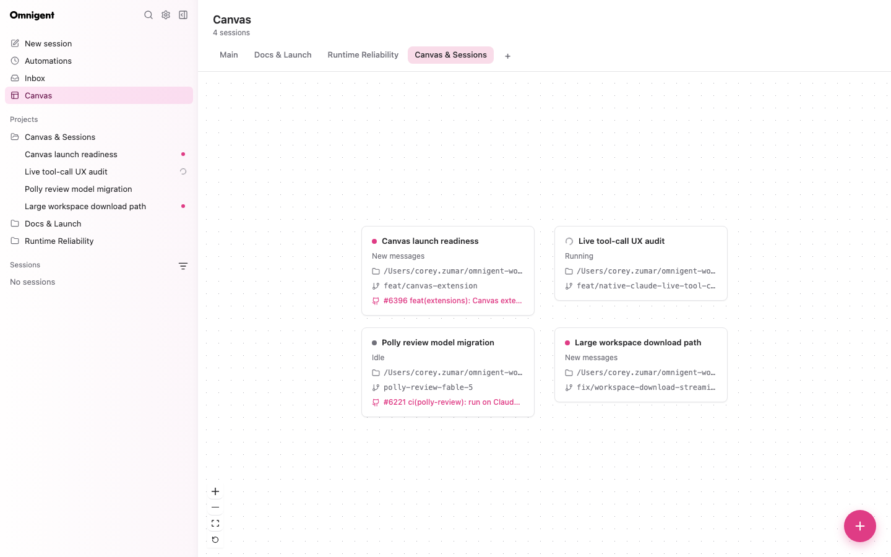

# Omnigent Canvas

An independently installable browser extension that visualizes accessible Omnigent sessions as draggable cards on a React Flow canvas.

Each card shows the session status, title, and working directory. Double-click a card (or focus it and press Enter/Space) to open Omnigent's existing session transcript.



## Install from this checkout

Build the browser bundle, install the Python distribution, and start Omnigent:

```bash
pnpm --filter @omnigent/canvas build
uv pip install -e ./extensions/canvas
uv run omnigent
```

The **Canvas** item then appears in primary navigation. Omnigent discovers the package through its `omnigent.extensions` entry point; no core source changes are required to register it.

## Development

```bash
pnpm --filter @omnigent/canvas type-check
pnpm --filter @omnigent/canvas test
pnpm --filter @omnigent/canvas build
```

The committed build artifacts live in `src/omnigent_canvas/dist/` so the Python package is immediately usable after installation.

## Storage and privacy

The extension requests `navigation`, `sessions.read`, `projects.read`, `projects.write`, and `storage.user`. Sessions are grouped into one canvas per project plus a **Main** canvas for sessions outside any project; the **+** tab creates a new project. The host filters the session list to the current user's accessible, top-level, non-archived sessions. Manually arranged card positions and the viewport are stored locally in extension-scoped browser storage; transcript content is never read by this extension.
